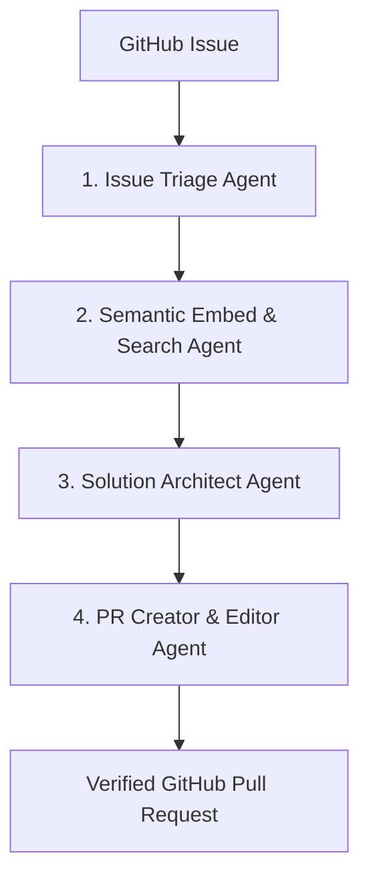

# Gitbo 🚀

Gitbo is an autonomous agentic AI coding assistant designed to streamline the software onboarding and bug-fixing process. By analyzing a GitHub issue description, Gitbo searches the repository using semantic vector embeddings, constructs a targeted solution design, executes search-and-replace code modifications, and automatically opens a verified Pull Request (PR) on GitHub.

Built with a modern, glassmorphic dark-themed developer dashboard, Gitbo offers real-time visualization of the AI workflow steps.

---

## 🏗️ Architecture: The 4-Agent Pipeline

Gitbo orchestrates a multi-agent workflow using **LangGraph** to process incoming issue descriptions:



1.  **Issue Triage Agent**: Analyzes the problem description to diagnose root causes and identify the components/directories likely to be affected.
2.  **Semantic Embed & Search Agent**: Automatically chunks local source code using AST/braces parsing, generates text embeddings using `sentence-transformers`, indexes them in an ephemeral vector database (ChromaDB), and queries them to retrieve the most relevant code contexts.
3.  **Solution Architect Agent**: Formulates a detailed technical fix plan based on the retrieved code snippets.
4.  **PR Creator & Editor Agent**: Applies precise `<<<<<<< SEARCH` / `=======` / `>>>>>>> REPLACE` updates on the codebase, commits the changes to a new branch, and pushes them to GitHub to open a Pull Request.

---

## 🛠️ Tech Stack

*   **Backend**: FastAPI, LangGraph, ChromaDB, Sentence-Transformers (`BAAI/bge-small-en-v1.5`), PyGithub
*   **Frontend**: Vanilla HTML5, CSS3 Custom Properties (Glassmorphic Dark Theme), and Vanilla JavaScript
*   **AI Inference**: Powered by LLMs (e.g., Llama/Qwen models) via the Groq API

---

## 📂 Project Structure

```
Gitbo/
├── backend/
│   ├── main.py          # FastAPI application server & routes
│   ├── agents.py        # LangGraph workflow definition & agents logic
│   └── utils/
│       ├── chunker.py   # Multi-language AST/sliding-window chunker
│       ├── parser.py    # Search/Replace parser with fuzzy matching
│       └── git_handler.py # Git & PyGithub interface
├── frontend/
│   ├── index.html       # Single-page dashboard interface
│   ├── style.css        # Custom CSS variables, responsive design, glassmorphism
│   └── app.js           # API controller & terminal rendering
├── .gitignore           # Ignores large venvs, env vars, and build caches
├── requirements.txt     # Python backend dependencies
└── README.md            # Project documentation (this file)
```

---

## 🚀 Getting Started

### Prerequisites

*   **Python**: Version 3.8 or higher.
*   **Git**: Must be installed and configured on your path.
*   **GitHub Personal Access Token (PAT)**: Requires a token with `repo` scopes (or fine-grained permission for `Contents` and `Pull Requests` write access) to open PRs.

### Installation

1.  Clone the repository:
    ```bash
    git clone https://github.com/marbo786/Gitbo.git
    cd Gitbo
    ```

2.  Create and activate a virtual environment:
    ```bash
    python -m venv .venv
    # Windows:
    .venv\Scripts\activate
    # macOS/Linux:
    source .venv/bin/activate
    ```

3.  Install dependencies:
    ```bash
    pip install -r requirements.txt
    ```

4.  Configure your environment variables. Create a `.env` file in the root of the project:
    ```env
    GROQ_API_KEY=gsk_your_groq_api_key
    ```

### Running Locally

1.  Start the FastAPI backend server:
    ```bash
    python -m uvicorn backend.main:app --port 8000
    ```
2.  Open your browser and navigate to:
    [http://localhost:8000](http://localhost:8000)

3.  Provide the GitHub repo URL, the issue description, and your GitHub PAT to run the agentic pipeline and see the visual output in real-time!

> [!NOTE]
> **CORS Security:** By default, the API restricts CORS to `http://localhost:8000` and `http://127.0.0.1:8000`. To run the frontend on a different domain, set the `ALLOWED_ORIGINS` environment variable (e.g. `ALLOWED_ORIGINS=https://yourapp.example.com`).
